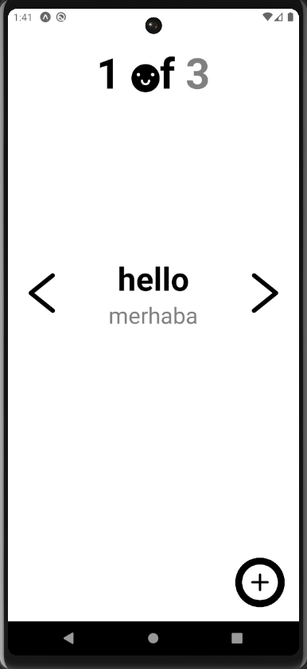
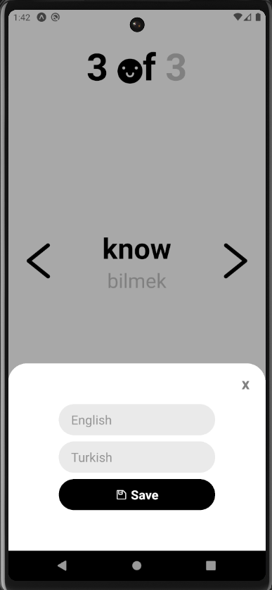

# dictionary-app

## Description

My goal in this project was to learn and implement the <b>Redux Toolkit </b> and <b> Async Storage </b> structure in a better way.

## Technologies

- Expo
- React Native
- Redux Toolkit
- Async Storage

## Images

